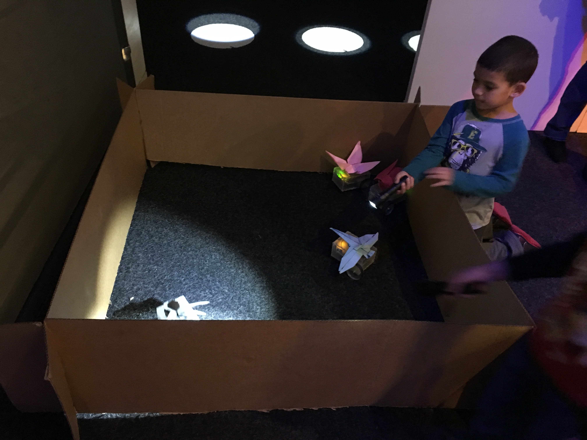
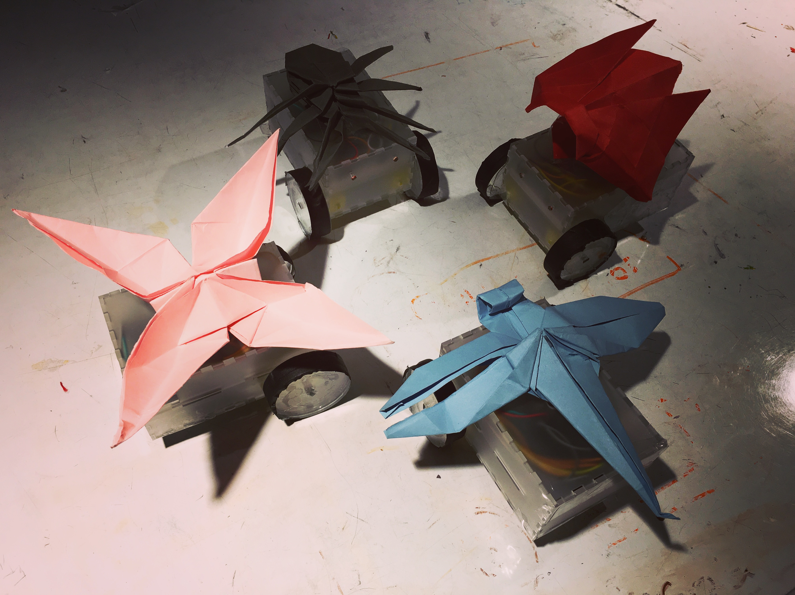
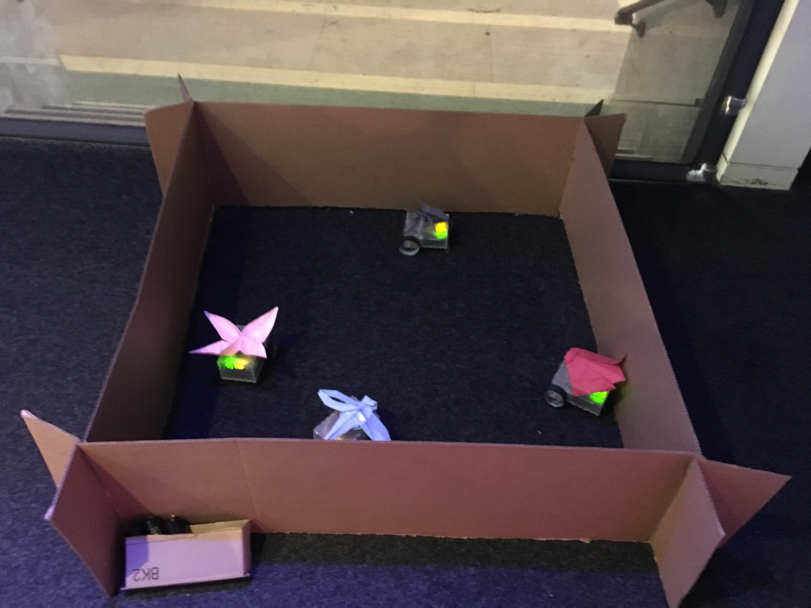

# Insectopia
An arduino project featuring light-sensitive origami insects.

## Abstract

Insectopia showcases light-responsive origami insects that the audience can interact with provided flashlights. Each origami insect can move on its own and respond in unique fashions to light using photocells sensors and DC motors. Although with several technical flaws and much room for improvement, the project was attractive to the audience and evoked much wonder and delight in the younger children.

## Objectives

The goal was to create origami insects that respond to light in unique, interesting ways. Four origami insects, each coded with a different light-responsive behavior, react to light in an enclosed space. The audience would be using flashlights as the main method of interaction. The origami insects would be placed on moving vehicles, with the focus being on the insect instead of the vehicle. Thus, the size of the moving vehicle should ideally be minimized. Each insect would also exhibit the following behaviors:

Dragonfly – follow light source
Ladybug – crawl
Butterfly – circling
Spider – avoid light source
In effect, the project should not only evoke wonder but also allow children to demonstrate their autonomy and initiative as they control the light flashed onto the insects to manipulate their movements.

## Implementation

Origami insects were folded and placed on moving vehicles. There were four origami insect structures that varied only in terms of coded behavior and origami insect design. The dxf files for each vehicle was created using an online box designer (http://boxdesigner.connectionlab.org/) to create an interlocking box and modified using Adobe Illustrator. Spaces for the DC motor holes and protrusions, intermediate platform insertion, wires, roller ball transfer bearings, Arduino USB cable port, and two photocells were added in the design. The box was first laser cutted using a 1/8 inch thick frosted acrylic sheet. A roller ball transfer bearing was attached to the bottom sheet using the appropriate sized nuts and bolts.  Two DC motors were press-fitted into the designated holes and fixed into place on each side sheet. The box was essentially divided into two levels, separated by an intermediate platform within. One level contained the two DC motors and the battery box (containing 4 AA batteries), and the second level contained the breadboard and arduino. The wires of the batteries would extend to the upper level through the holes of the intermediate platform (that had protrusions to fit into the side sheets)  and connect to the arduino. The arduino (Elegoo UNO R3) and breadboard layout consisted of 2 photocells, 2 5.6K resistors(for the photocells), a DRV8835 dual motor drive to manipulate DC motor movement, and corresponding wires. The photocell sensors would be placed on the front outer surface of the box. Once the box was glued into place using a hot glue gun, wheels would be press-fitted and glued onto each DC motor. Each wheel was made by laser-cutting 1/4 inch thick transparent acrylic sheets into cylindrical shapes with a radius of 35 mm and a rectangle for press fitting into the DC motor rod. 3 laser cut circular pieces would be glued together to create one wheel.  Duct tape was glued along the wheel circumferences in order to increase friction. Finally, the origami insects, folded with colored construction paper, were taped on top of each vehicle. A cardboard fence (150 x 150 cm) was made to contain these orgami insect structures. To prevent the vehicle from being stuck at a wall/corner, the behavior of each origami insect structure was coded such that the vehicle would back off every once in a while.

## Outcomes

Although there were some technical difficulties during the actual implementation of the project, the children and adults seemed pretty fascinated by the overall results. Most of the audience noticed the flash lights and used them on the installation. Children were generally excited when they discovered the light-responding behavior of the insects. Some would try to make each insect move at a time, while some would hold multiple flash lights at a time. The installation seemed to attract younger children (age below 7) more than older children. Parents also liked to get involved, ask me about how it worked, and/or explain to the children about how it worked. The children were also generally gentle when physically touching or picking up the origami insects, and no major fixing was needed.

While the museum experience conceptually proved the project to be attractive, there is still much room for improvement. The coded behavior of the insects wasn’t really optimal. It would be better if they had a faster reaction time and more dramatic, signature movements to distinguish them. I had modified some of the code upon noticing this issue, and more time to experiment with different coded behavior would’ve been more ideal. The floor mat was also rougher than anticipated, and sometimes the friction would prevent the wheels from turning.  When the vehicle faces the cardboard wall, the flashlights cannot really reach the sensors in the front. Thus, it would’ve been better if photocells sensors were available in both front and back of each vehicle.

## Images

<\p>
## Contribution

Conceptualization, design, and implementation were mostly done by the one author.
